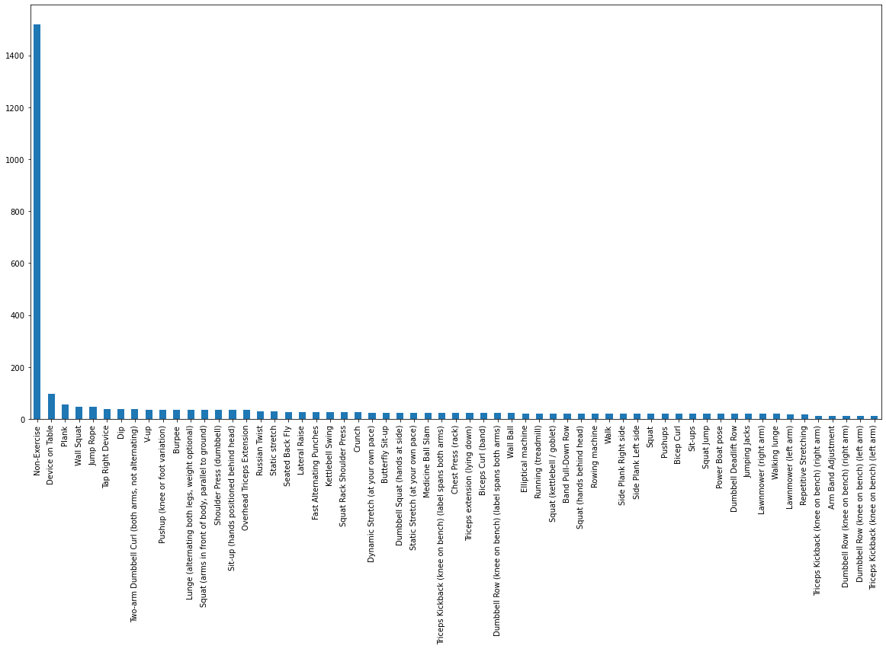

이 포스팅은 다음 [블로그](https://medium.com/gumgum-tech/handling-class-imbalance-by-introducing-sample-weighting-in-the-loss-function-3bdebd8203b4)를 주로 참고해 작성됐습니다.

- 데이터 imbalance는 실제 데이터에서 매우 흔히 발견될 수 있는 문제
- class imbalance에 대해 설명하고 해결 방법을 소개

# Class imbalance

- 특정 클래스의 수가 다른 클래스의 데이터의 수에 비해 꽤 적을 때를 의미함
- 아래와 같은 상황이 데이터 불균형이 존재하는 상황
    - [데이콘 운동 동작 분류 대회](https://dacon.io/competitions/official/235689/data/)에서 데이터 불균형이 존재하는 데이터 접근 가능
    - Non-Exercise는 1500개가 넘는 데이터가 존재하지만 그 외의 데이터는 200개 이하의 데이터를 갖습니다.

## Class imbalace가 왜 문제가 되는지

- 대부분의 머신러닝 모델은 class간의 데이터의 비율이 비슷하다는 가정에서 성립됨
- training을 할 때 imbalance가 크다면 데이터의 수가 많은 class로 치우치게 predict하도록 학습됨
    - 학습을 수행하는 loss 값에 각각 데이터 샘플 별로 기여를 하기 때문에, 샘플 수가 많은 majority class만을 잘 예측하도록 학습됨
    - 예를 들어 binary classification에서 class 0에 90%의 샘플이 있고, class 1에 10%의 샘플이 있을 때, loss 값에는 class 0가 90%, class 1이 10% 기여를 하는 셈이고 모든 예측을 0으로 한다고해도 90%의 정확도를 갖는 예측을 할 수 있게됨.

## Class imbalance의 해결방법

### 1. Resampling - undersampling , oversampling

- 클래스별 데이터의 수를 맞춰주기 위해 클래스별로 sampling을 달리해 학습하는 방법
- 효과적으로 문제를 해결하는데 어려움이 있고, 오히려 새로운 문제점을 야기할 수 있음
- Undersampling for majority class
    - 많은 데이터를 가지고있는 class의 데이터의 일부를 버리는 방식으로 class간 데이터 수의 균형을 맞추는 방법
    - 버려진 데이터에서 학습할 수 있는 유용한 정보들을 학습할 수 없는 문제점
- Oversampling for minority class
    - 적은 수의 데이터를 복원 추출해 class간 데이터 수의 균형을 맞추는 방법
    - 모델이 학습해야하는 데이터의 수가 증가하기 때문에 학습 시간이 많이 소요됨
    - 그럼에도 복원 추출된 데이터가 새로운 데이터가 아니기 때문에 해당 데이터 셋에 오버피팅 될 수 있음
- loss function에 가중치를 주는 식으로 접근할 수 있음

### 2. Weighting in Loss Function

- class 별로 loss function에 weight를 주는 방식과 sample별로 weight를 주는 방식이 존재
- 둘 다 minority class에 속한 데이터 샘플에 더 집중해 학습할 수 있도록, loss 값에 weight를 부여하는 방법

$$L = \sum l_i \quad \to \quad L_{weighted} = \sum w_i*l_i$$

***Class Weight***

- class weight는 전체 학습 데이터에 대해서 클래스별 가중치를 계산하는 방법으로 같은 클래스 내의 데이터 샘플은 같은 weight값을 갖는다.
- class i에 해당하는 class weight는 다음과 같이 계산. sklearn에서 제공하는 compute_class_weight로 계산, 활용 가능

$$w_i = \frac{total\ num\ samples}{num\ samples\ in \ class \ i\times n\_classes}$$

- total num samples와 n_classes는 weight를 normalizing하는 항으로 class별 샘플의 역수가 weight를 결정함

***Sample Weight***

- 개념적으로는 class wieght와 같지만 전체 배치가 아니라 미니 배치 상에서 sample 수를 고려해 loss를 계산하는 방법
- 블로그에서 세가지 방법을 소개함
    - *Inverse of Number of Samples (INS)*
        - 말 그대로 배치 내에서 sample의 빈도
        - 배치 내의 n번째 샘플이 class i에 속할 때 sample weight는

    $$w_{n,i} = \frac{1}{Number \ of\ samples\  in\ Class_i}$$

    - *Inverse of Square Root of Number of Samples (ISNS)*
        - 배치 내에서 sample의 빈도의 루트값
        - 배치 내의 n번째 샘플이 class i에 속할 때 sample weight는

        $$w_{n,i} = \frac{1}{\sqrt{Number \ of\ samples\  in\ Class_i}}$$

    - *Effective Number of Samples (ENS)*
        - [Cui, Yin, et al.](https://openaccess.thecvf.com/content_CVPR_2019/html/Cui_Class-Balanced_Loss_Based_on_Effective_Number_of_Samples_CVPR_2019_paper.html)이 제안된 방법
        - sample 수만 관심을 갖는 것이 아니라, data sample의 분포를 함께 고려한 유효 샘플 수 (effective number of samples)

        $$w_{m,i} = \frac{1}{E_{n_{c}}}\\    
        {E_{n_{c}}} = \frac{1-\beta^{n_c} }{1-\beta}$$

        - $\beta$는 hyperparameter로 논문의 저자는 0.9, 0.99, 0.999로 바꿔가며 실험을 해보길 권함
    - sample weight에서도 class weight와 같이 normalize해서 활용할 수 있음

## Case study

- [Ishan Shrivastava의 블로그](https://medium.com/gumgum-tech/handling-class-imbalance-by-introducing-sample-weighting-in-the-loss-function-3bdebd8203b4)에서 3가지 sample weight 계산 방법과 weight를 주지 않은 경우에 대해 성능을 비교
- loss에 weight를 부여했을 때 minor class에서 성능의 향상이 두드러진 것을 보임
- 세가지 방법 중 INS가 가장 좋은 성능을 보임
- 그 이유를 ISNS와 ENS는 극심한 불균형을 가지는 데이터셋에 잘 작동을 하는 알고리즘이지만 실험에 사용한 데이터셋은 불균형 정도가 심하지 않았다는 것으로 설명함

## Summary

- Machine learning에 관련된 문제 중 데이터 불균형 문제를 소개함
- 불균형 문제의 해결 방법중 resampling 방법의 한계점을 지적하고 loss function에 weight를 주는 방식으로 해결하는 연구를 소개함
- Ishan Shrivastava의 실험에서 상황에 맞는 weight 부여 방식 활용의 필요성을 확인함

## 마무리

- 이번 글을 작성하며 모든 상황에 맞는 만능키는 없다는 생각을 하게 됨
- class 불균형이 매우 심한 binary classification의 경우에 이상 감지(anomaly detection) 방식으로 접근하는 것도 효과적
- CUi, Yin, et al.논문을 읽고 구현해볼 계획

***추후에 class weight 적용하는 예제 추가 계획***

# Reference

[What is the difference between sample weight and class weight options in scikit learn? - Stack Overflow](https://stats.stackexchange.com/questions/244630/difference-between-sample-weight-and-class-weight-randomforest-classifier)

[불균형 데이터 분류 / TensorFlow Core](https://www.tensorflow.org/tutorials/structured_data/imbalanced_data)

[sklearn.utils.class_weight.compute_class_weight ](https://scikit-learn.org/stable/modules/generated/sklearn.utils.class_weight.compute_class_weight.html)

[Cui, Yin, et al. "Class-balanced loss based on effective number of samples." Proceedings of the IEEE/CVF Conference on Computer Vision and Pattern Recognition. 2019.](https://openaccess.thecvf.com/content_CVPR_2019/papers/Cui_Class-Balanced_Loss_Based_on_Effective_Number_of_Samples_CVPR_2019_paper.pdf)

[운동 동작 분류 AI 경진대회](https://dacon.io/competitions/official/235689/overview/description/)
